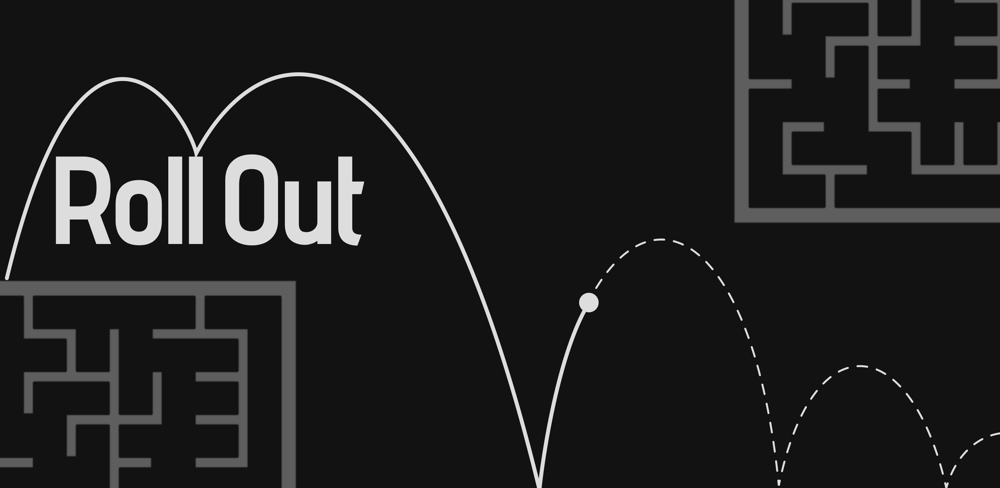
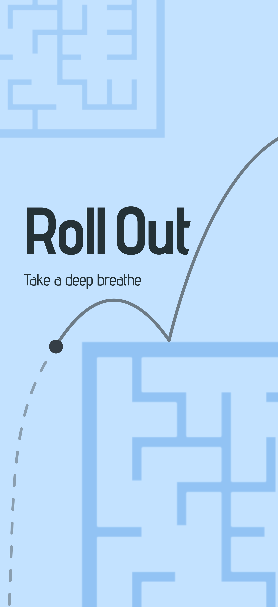
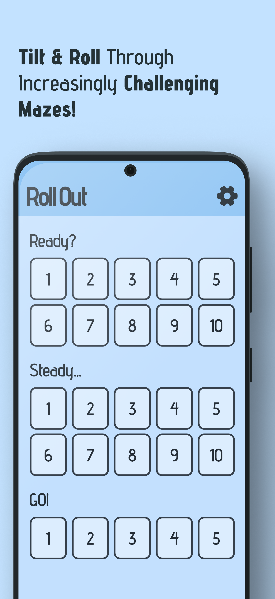
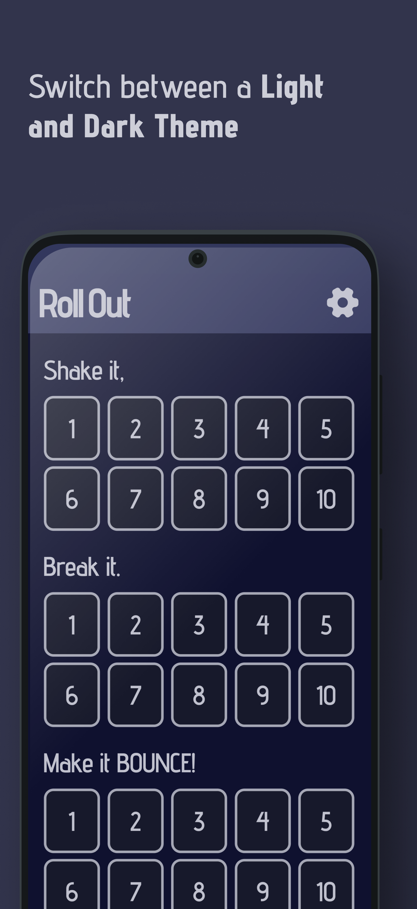
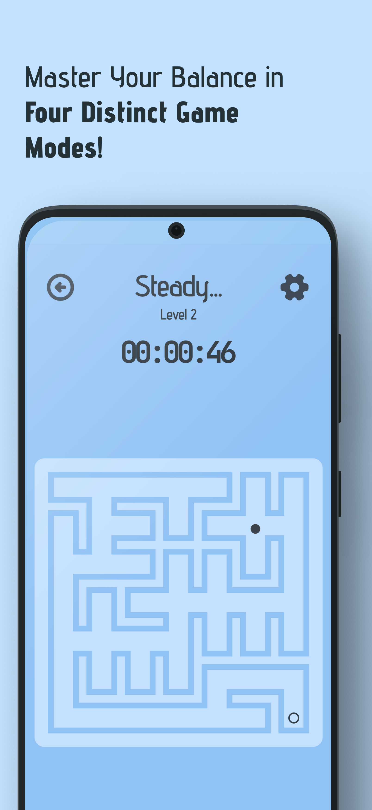
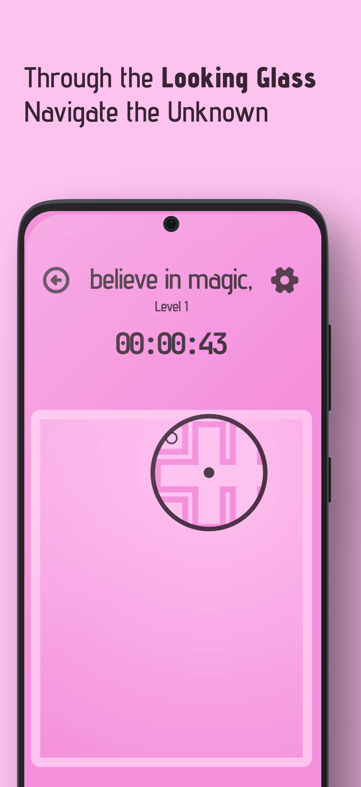
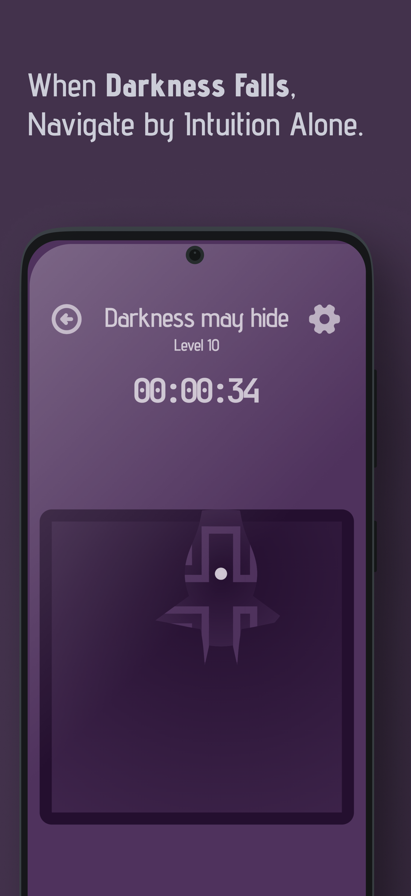

# Roll Out

**Roll Out** is a physics-based maze game where the objective is to roll a ball out of the maze by tilting your phone. The game is developed using Flutter, incorporating the Flame and Forge2D physics engines.

## Features

- Engaging physics-based gameplay
- Intuitive tilt controls
- Beautifully designed mazes and game modes

## Screenshots

Samples taken from live app testing

    
    
    
    
    
    

## Roadmap

I have exciting plans for the future scope of **Roll Out**:

- **Unlimited Mode**: Explore an endless mazes with increasing difficulties.
- **Leaderboards**: Compete with other players.
- **Multiplayer**: Challenge others players in real-time.
- **New Game Mode**: Capture the Stars.

## Dev Notes

The app is currently under closed testing and will enter Open Testing in the April of 2025
